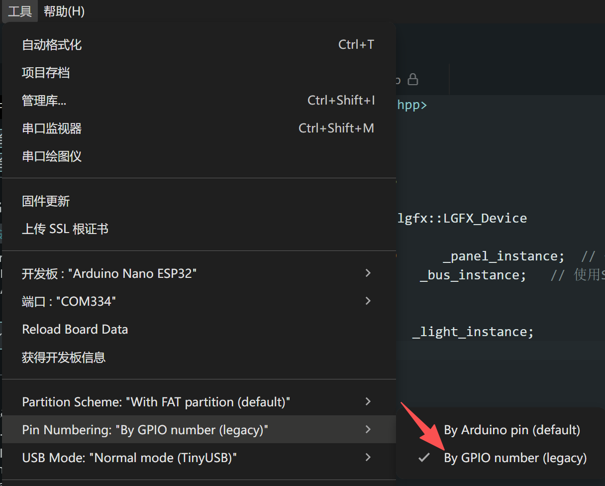

# Arduino library

为启明 WT9932S3-NANO 的一个 arduino 支持库。内涵一系列库，方便用户开发调用

## 如何搭建 Arduino 环境

### 前期准备

1. ESP32S3 nano 开发板
2. 面包板
3. 杜邦线
4. USB A 口转 C 口 线
5. Arduino IDE

### 环境搭建

1. 打开 Arduino IDE ，点击开发板图标，搜索框输入 esp32，选择 Arduino esp32 nano 并安装最新版
   
2. 选择 文件->示例->ESP32->ChipID->GetChipID
   
3. 点击左上角的 √ 进行编译，编译完成右下角会显示
   
4. `工具`中选择`编程器`为 Esptool
   
5. 用 USB 线连接开发板和电脑，并在 Arduino IDE 中选择已连接的开发板
   
   > 如果你的开发板识别到的不是 Arduino NANO ESP32，则可以通过 `工具`->`开发板`->`Arduino ESP32 Boards`->`Arduino Nano ESP32` 手动将它切换到正确的开发板
6. 选择`项目`中`使用编程器上传`(首次需要，后续直接使用上传按钮即可)
   
7. 点击`串口调试器`查看打印内容
   

   

## 注意事项

本开发板和Arduino Nano 的引脚相同，arduino对开发板的引脚进行了自己的宏定义。也就是开发板丝印标注的。

我们可以参考如下原理图，对应到乐鑫官方的GPIO Number

如果想使用乐鑫官方的 GPIO Number 记得修改Arduino IDE的配置：
选择 `By GPIO number`
   

